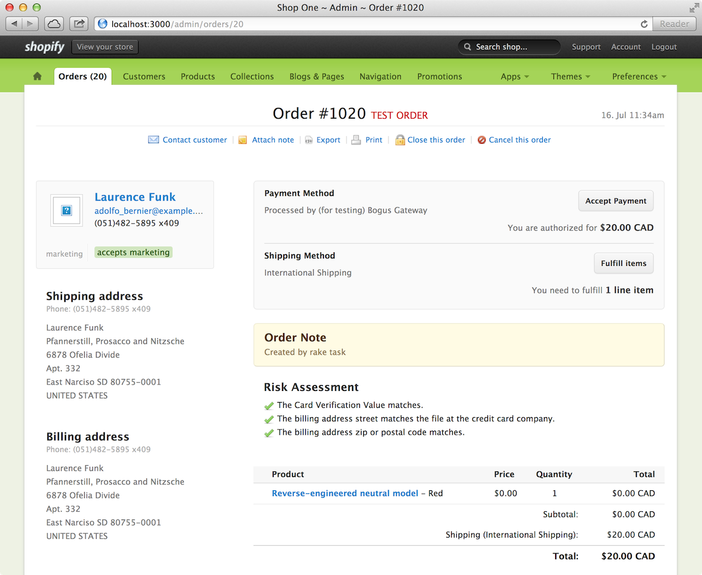
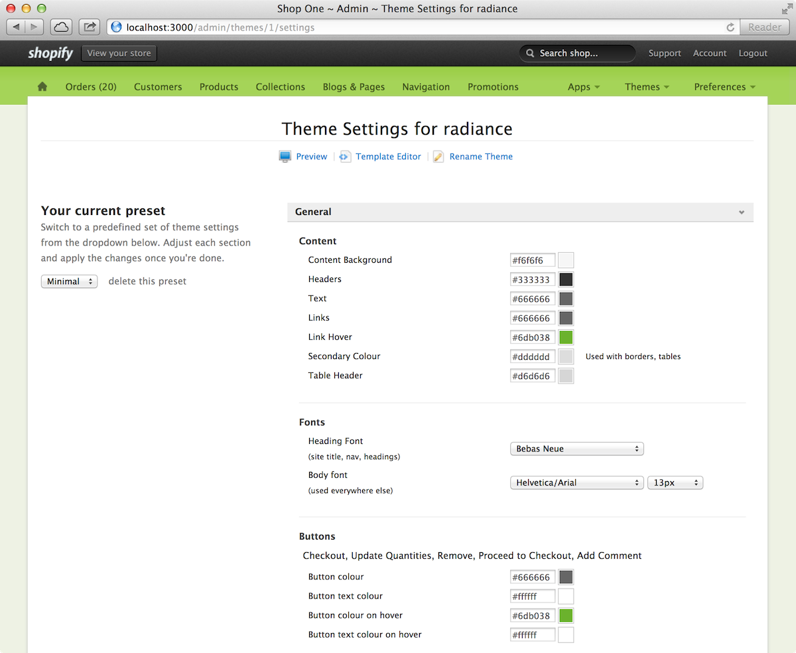

!SLIDE
# how to do stuff in java #

<h1><em class="orange">illustrated with stock photos</em></h1>

.quote -1

.quote-display [@nciagra](http://twitter.com/nciagra)

.notes Hi everybody! I'd like to tell you I go by Dr. Nick but apparently

!SLIDE[tpl=image]

.notes this man already has a trademark on that name.
Instead, I'll just go with

!SLIDE
<h1 style="text-transform:none"> Sir Nicholas J. Small III Sr. </h1>

.quote -1

.quote-display [@nciagra](http://twitter.com/nciagra)

.notes I don't accept nicknames.

!SLIDE[tpl=image]

.notes I work at Shopify on internety things.
Using Java.

!SLIDE
	@@@ java
	import com.*.jar

.notes That's what this conference is about, right?

!SLIDE[tpl=image]

.notes No, i'm kidding, we're an all Ruby and JavaScript shop.

!SLIDE
# we need a framework for building a huge application #

.notes because

!SLIDE
# THIS #

!SLIDE
# IS #

!SLIDE[tpl=image]

.notes and we don't fuck around

!SLIDE[tpl=image]

!SLIDE[tpl=image]

.notes For the unfamiliar, Shopify is the world's greatest ecommerce platform for doing ecommercy things.
This is the orders screen of our admin interface, and as you can see in this horribly scaled image,
there's a lot of shit in here

!SLIDE[tpl=image]

.notes Here's theme settings, where you can use an HTML interface to modify most of the parameters of your storefront's look and feel.
Color pickers, html5 forms, lots more nasty stuff.

!SLIDE
# shopify 1 #
## is a rails app. #

.notes shopify 1 is a rails appand desperately needed to be modernized.
but there's some problems

!SLIDE
## it has an obscene amount of html files. ##
# over 500 #

.notes Our views folder is ridonkadonk budunkadunk big.

!SLIDE
## it has an obscene amount of rails code. ##
# over 9000! #

.notes and most of this is business logic which would just be silly to move to a different language.

.quote 28

!SLIDE[tpl=image]
# it's this big. #

!SLIDE
# so, how do we modernize this? #

.notes So, how do we modernize this?
It's easy!

!SLIDE
## it's easy. ##
# use backbone.js. #

!SLIDE
# thanks. #

.notes thanks, goodbye!

!SLIDE
# backbone is great. #

.notes Jokes jokes, backbone is amazing.
Whether it's transitional or Tom Dale is a git, it's an amazing piece of code.
But it didn't have enough structure to give us what we needed.

!SLIDE
# ember is great. #

.notes If you haven't noticed, this is that certain measuring part of my talk.

!SLIDE[tpl=image]
# it's this big. #

!SLIDE
# ember is great. #
.notes Ember is great, but being a Cappuccino core developer, I have moral objections to Ember.

!SLIDE
# _____ is great. #

.notes Everything out there is great. Everyone solves this similar problem domain in very different ways.
Obviously, we need an entire conference to argue about which framework is best.

!SLIDE
# luckily, I have the answer. #

!SLIDE[tpl=image]
# it's simple. #

!SLIDE
# you pick the tool that is best suited to your needs #

.notes It's simple, you pick the tool that does exactly what you need it to.
I'd posit that there is no right answer for which frameork everyone of you should use.
So, you either pick the right tool, or you

!SLIDE
# you <strike>pick</strike> build the tool that is best suited to your needs #

.notes build the right tool.
So, that's what we did.
We built a framework to build apps exactly the way that shopify wanted, after we had been building apps for 5 years.

!SLIDE[tpl=image]

.notes the rest of this talk will simply consist of me humming the score of The Dark Knight. Cool? Cool. Cool cool cool.
