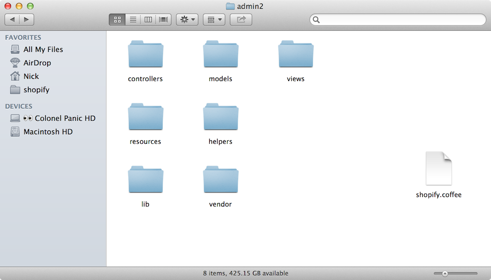

!SLIDE
## you should use batman.js if: ##

* you want to write in coffeescript to make your life easy
* you want to follow specific, Rails-like conventions to make your life easy
* you/your designer want to layout your UI and bindings in HTML
* you have a separate, ideally RESTful, API component

.notes ok look, this whole conference, I just wanted to see one thing from each framework:
This chart.
COFFEESCRIPT
STRONG CONVENTIONS
PLAIN HTML FOR DATA BINDINGS
SUPER EASY API... COPULATION

.quote -1

!SLIDE
## you should _not_ use batman.js if: ##

* you are going to whine about having better syntax
* you want to use the same model code on the client and server
* you hate HTML; you should probably try Cappuccino
* you don't agree with our conventions or you really like XML configuration files

.quote -1

!SLIDE
# "But Sir Nicholas III, why would you want to use CoffeeScript over JavaScript?" #

.notes First of all, that's Sir Nicholas J. Small III Sr. to you.
Second of all, this is a question I have been asked many times.
I've gotten really good at answering.

!SLIDE
# Because it's better. #

!SLIDE
# That's why. #

!SLIDE[tpl=image]

.notes And because I don't hate myself.
The next person who asks why I would "limit batman's potential" by using a set of elegant syntax additions gets a much more... vulgar answer.
But please, by all means, don't be afraid to ask!

!SLIDE
# batman is strongly opinionated. #

!SLIDE
# like rails. #

!SLIDE[tpl=image]

.notes See, look how clean that looks!

!SLIDE
# actually, _a lot_ like rails. #

.notes If you're familiar with Rails, you'll feel pretty comfortable in the batman environment.
To be clear, batman is not even remotely a port of rails, that would be absolutely fucking stupid.
We just follow a lot of similar conventions.

!SLIDE[tpl=image]
# similar directory structure #

.notes It gives you a clear, convienent place to put everything, and all the right files can be automatically included.
Obviously this is a HORRIBLE example, no one would EVER use icon view in Finder.

!SLIDE
# "But Sir Nicholas III, what if I want to put my files somewhere else?" #

!SLIDE[tpl=image]

.notes Either use a different framework, or put your files where the files go.
